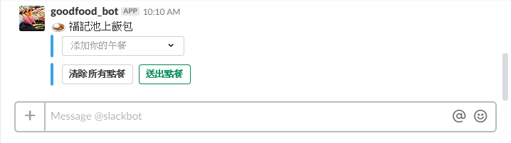
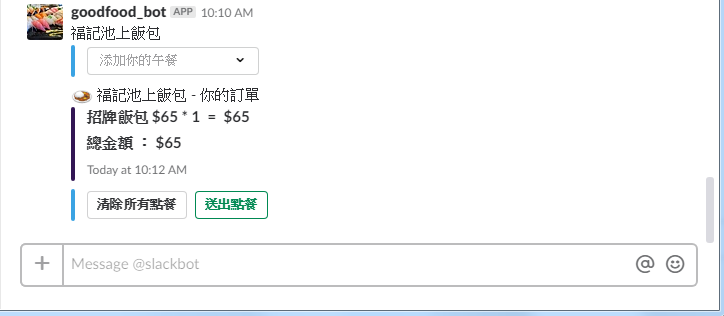
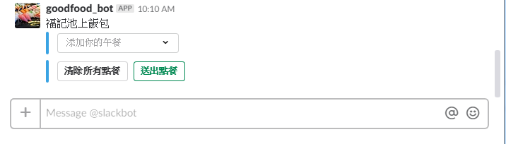

# GoodFood-Bot Usage

### API
- [API列表](http://goodfood-beta.trunksys.com/docs/)

### Test POST Message

curl
```
$ curl -d "message=這是一則給 #test-bot 而且來自於 *紅色巨鳥*.<https://www.google.com.tw>" -H "Content-Type: application/x-www-form-urlencoded" -H "Authorization: test" -X POST http://goodfood-beta.trunksys.com/message
```

axios
```javascript
this.$axios({
    method: 'post',
    url: 'http://goodfood-beta.trunksys.com/message',
    data: { 
        message: '今天吃大便當',
        channel: '#general'
    },
    headers: {'Authorization': '0ffd55100b68587e9cb7613481a0bc89a5c822bbf5b1dca49299f21ce13fb520'},
}).then(function (response) {
    console.log(response.data);  // {ok: true} will print
})
.catch(function (error) {
    console.log(error);
});
```

fetch
```javascript
fetch(  'https://goodfood-beta.trunksys.com/message',
        {
            method: 'POST',
            headers: 
            {
                'Content-Type': 'application/x-www-form-urlencoded',
            },
            body: 'message=今天吃大便當喔喔喔TEST&channel=#test-bot&attachments=yes&order_id=-L6gqAiUoE6CyZ5DKKKE&order_store=-L6gqAidhannMbBCIBM3&order_url=https://www.google.com.tw/'
        }).then( (res) => {console.log(res)} )
```

### Parameters


### Response

- {"ok": true}
- {"ok": false}

### Other

- 需要授權才能發話 ， 如 header 裡的 "Authorization: firebase-uid"(會員綁定實做後作用)
- message 中有多種文字格式可以套用，參考下面二例
- \***裡面會是粗體字**\*
- <裡面會是網址>  用非網址文字會變箭頭括號包起來的文字

<hr>

### TEST GET Channel list

curl
```bash
$ curl https://goodfood-beta.trunksys.com/channels
```

fetch
```javascript
fetch('https://goodfood-beta.trunksys.com/channels')
    .then(function(response) {
        return response.json();
    }).then(function(myJson) {
        console.log(myJson);
    }
);
```

### Response

```json
{
    "ok": true, 
    "channels": 
    [
        {
            "id": "C7756DN4S", 
            "name": "general"
        },
        {
            "id": "C781W41U6", 
            "name": "random"
        },
        {
            "id": "C97GD0QR5", 
            "name": "test-bot"
        }
    ]
}
```

<hr>

## Order in slack

**※前置要求： 已經在好食在頁面與 slack帳號綁定**<br>

<br>**一、當機器人發送的訊息中，有 "從Slack點餐" 這個按鈕時點擊他，機器人就會私訊你**

<br>**二、點擊訊息中 "添加你的午餐"**

<br>**三、點擊你欲點的午餐**

<br>**四、會彈出視窗，輸入選項 (多選項暫無作用，與前端同步後才會做用)**

<br>**五、點完餐後訊息會發生改變**

<br>**六、一個不夠要多吃兩個訊息會長這樣 (加蛋為裝飾用，沒有效果，不過會顯示)**

<br>**七、點錯了點擊 "清除所有餐點"要清除點單列表，會回歸原樣**

<br>**八、送出點餐，這裡點的是招牌飯包**

<br>**九、點完餐後會顯示個人的點單結果**
<br>　　**不點也可以送出點餐，不過你就沒有東西吃囉**


<hr>

### Command

- /cheese

### Test API

- 在任何聊天室裡輸入
```
/cheese
```

### Response

- 等待約一秒
- 在聊天室裡會出現
```
[yourname]是最[ooxx]的人
  每日占卜~
```

<hr>

# Installation

### Install curl

```
$ sudo apt-get install curl
```

### Install nvm

```
$ curl -o- https://raw.githubusercontent.com/creationix/nvm/v0.32.1/install.sh | bash
```

### Install nodejs

```
$ nvm install v8.9.1
```

### Create slack app and get token

- [slack app網址](https://api.slack.com/apps)
- 點擊 Create New App ， 會導向 App 資訊頁
- 展開 Add features and functionality
- 點擊 Bots 新增一個機器人
- 回到 App 資訊頁
- 展開 Install your app to your workspace 並安裝(保存的意思) App 到你的 slack workplace
- 安裝成功之後回到 App 資訊頁
- 展開 Add features and functionality
- 點擊 Permissions
- 可以看到有 Bot User OAuth Access Token 這一欄位
- 保管好你的機器人 Token ， 不要被A走

### Create slack command

- 展開 Add features and functionality
- 點擊 Slash Commands
- 點擊 Create New Command
- 欄位範例 (解釋參考底下)：
- - Command ： /cheese
- - Request URL ： http://goodfood-beta.trunksys.com/slack/cheese
- - Short Description ： 我的指令簡易說明
- - Usage Hint ： 我的指令提示
- - 勾勾不勾
- 點擊 Save 儲存
- 撰寫 http://goodfood-beta.trunksys.com/slack/cheese 的 api 功能

##### 解釋 ：

- Command 你的指令　|　如 /addform
- Request URL 指令被輸入時會傳送到哪邊　|　如https://example.com/slackapi/addform <br>
(注意： 如 slack app 會發佈給其他人使用 ， Request URL 就必須為 https)
- Short Description 在 slack 輸入指令時會出現的文字說明　|　如 新增表單
- Usage Hint 輸入指令時可能要帶的參數　|　如 [enter form name]

指令範例 ： /addform first-form <br>
會呼叫並將 first-form POST 到 https://example.com/slackapi/addform <br>
在該 api 底下撰寫 addform 功能 <br>

##### 傳送與回傳

指令發送時會 POST (application/x-www-form-urlencoded) 參數到該 api 底下 <br>
指令為 ： /addform @mike you good look the url http://ccc.ccc #here <br>
參數會是 
```
token=your-app-token
team_id=T0001
team_domain=example
enterprise_id=E0001
enterprise_name=TESTTESTTEST
channel_id=C2147483705
channel_name=test
user_id=U2147483697
user_name=Steve
command=/addform
text=@mike you good look the url <http://ccc.ccc> #here
response_url=https://example.com/slackapi/addform
trigger_id=13345224609.738474920.8088930838d88f008e0
```
- 如果勾勾有勾 text 會變成
```
text=<@U012ABCDEF|mike> you good look the url <http://ccc.ccc> <#C012ABCDE|here>
```
- your-app-token 是你的 app 資訊頁裡所看到的 Verification Token
- 可以比對 your-app-token 與 Verification Token ， 如相同就確定是來自於 slack 指令所發送

當處理完指令要回傳時可以回傳 ：
- plain text ， 他就會單純的回一句話
- json ， 必須在三秒內完成回應 ， 參考下面格式 ， [message formatting](https://api.slack.com/docs/formatting) 和 [attachment fields](https://api.slack.com/docs/attachments)
```json
{
    "text": "Plain text is this.",
    "attachments": [
        {
            "text":"Wow! Goooooood!"
        }
    ]
}
```
- 記得 respond with a HTTP 200 "OK" status code.
- Content-type header 要 application/json

##### 個人與聊天室可見

回傳的 json 中可以加 response_type
```json
{
    "response_type": "ephemeral",
    "text": "Sorry, that didn't work. Please try again."
}
```
這樣僅輸入指令的人可以看到訊息
ephemeral 改成 in_channel 就是聊天室都可以看到訊息


### Download project

```
$ git clone https://github.com/MonospaceTW/goodfood_bot.git
$ cd goodfood_bot
```

### Modify token

- 在跟 app.js 同一層資料夾創建 config.json
- 輸入
```json
{
    "BOT_TOKEN" : "your-bot-token"
}
```
- 存檔退出

### Modify port

- 開啟 /bin/www
- 修改你要的 port
```javascript
const port = '1234'; // modify your port here
```
- 存檔退出

### Run

```
$ npm install
$ npm start
```

## Add Swagger UI in to Project
1. Install `swagger-ui` nad `swagger-tools`
```
$ npm install swagger-ui
$ npm install swagger-tools
```
2. 在根目錄建立 `swagger.json`（可參考[範例](http://petstore.swagger.io/v2/swagger.json)）
3. 在 app.js 加入 swagger
```javascript
// app.js
const swaggerTools = require('swagger-tools');
const swaggerDoc = require('./swagger.json');

swaggerTools.initializeMiddleware(swaggerDoc, (middleware) => {
    app.use(middleware.swaggerUi());
})
```
4. 在 `http://yourdomain/docs` 開啟 swagger ui
